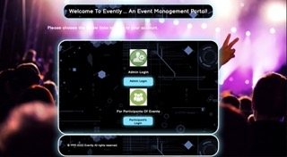

# Evently ... An Event Management Portal!

## 1. Project description:

Evently is an Event Management System. It is a Web Application for registering events. 

It allows access to two types of users, with the following functions:

1. Administrator -> Log in, Create Events, View Participant Events, View Participant Payments, Log Out.
2. Participant -> Register As New User, Log In As Existing User, Create Events, Pay For Events, View Events, Log Out.

## 2. Tech Stack:

HTML/CSS/JavaScript, Java 11, Java Servlet, JDBC, MySQL/MySQL Workbench/MySQL Server, Apache Tomcat Server, Git/GitHub.

## 3. Installing:

Prerequisite: Apache NetBeans 13.0, Apache Tomcat Server 10.0, MySQL Server, MySQL Workbench (Optional ... I prefer to perform MySql operations at the command line "mysql -u root -p")

1. Clone the repo.

```
https://github.com/AAdewunmi/Event-Management-System-Java.git
```

2. How to use:

a. Open project in NetBeans

b. Start SQL Server

c. Start Apache Tomcat Server

d. Run the application in the IDE (NetBeans)

e. You have two choices at the "Evently" landing page:

        (i) Login as an admin
        List of Admin usernames and password

        "A101"; "Admin101";

        "A202"; "Admin202";

        "A303"; "Admin303";

        "A404"; "Admin404";

        (ii) Login as a participant:
        - Register as new participant or 
        - Login as existing participant

## 4. Nice to have:

Payment gateway i.e. PayPal, Apple Pay, Google Pay etc.

Email / Text message notification.
    
## 5. Screenshot of the landing page:



## 6. Source:

- Adapted from:

UDEMY: Java Programming Bootcamp, Develop 20 Real World Projects, Java Web Application Development Course, 

Learn To Build Projects Using JSP, JDBC, Servlets, Swing, Spring Boot, Hibernate

- Project Name:
Project 2: Event Management System

- Created by: 
Engineering.Org.In

- Date Created:
Last updated 11/2021

- URL:
https://www.udemy.com/course/build-real-world-java-projects-jsp-servlets-springboot/
